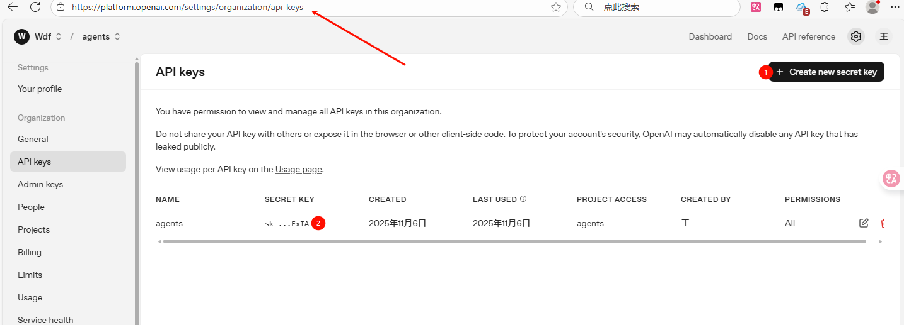
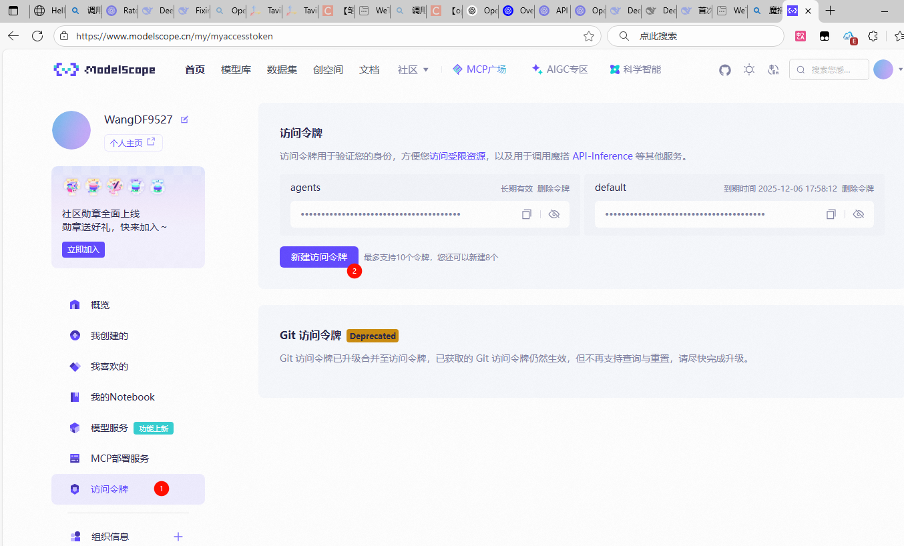
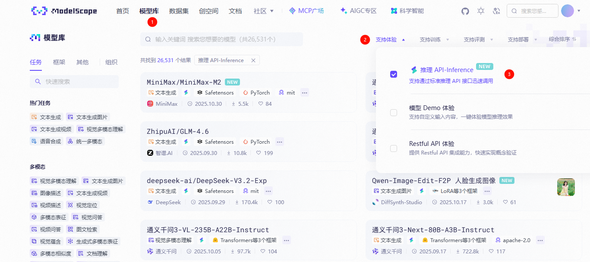
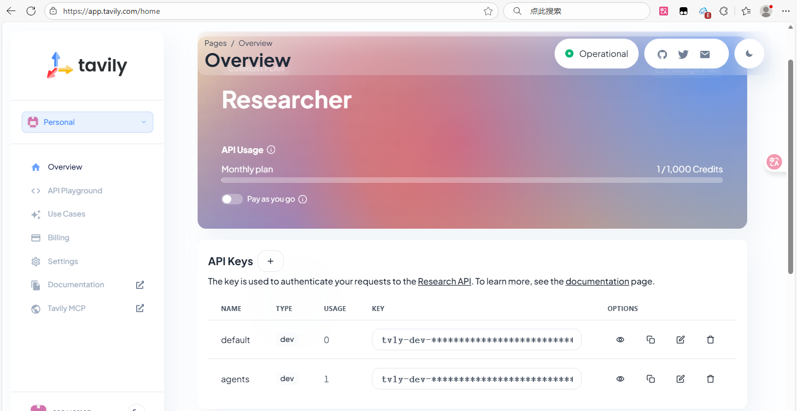
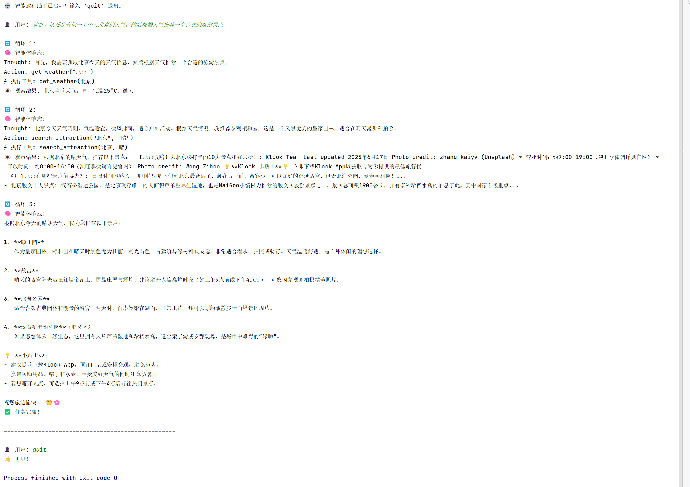

[教程第一章](https://datawhalechina.github.io/hello-agents/#/)
# 一、**智能体的核心定义与要素**

能够通过**传感器**感知**环境**，并**自主**通过**执行器**采取**行动**以达成目标的实体。

四要素：

- **环境（Environment）**：智能体所处的外部世界
- **传感器（Sensors）**：持续感知环境状态的能力
- **执行器（Actuators）**：改变环境状态的行动能力
- **自主性（Autonomy）**：独立决策和目标追求的能力

# 二、**智能体的演进脉络与分类体系**

- **传统智能体演进**: 从`反射智能体` -> `基于模型的反射智能体` -> `基于目标的智能体` -> `基于效用的智能体` -> `学习型智能体`。

- **LLM驱动的新范式**：理解大语言模型如何从根本上改变了智能体的决策机制，使其具备**规划与推理**、**工具使用**和**动态修正**能力。
- **三大分类维度**：
  - 基于**内部决策架构**（反应式 vs. 规划式 vs. 混合式）
  - 基于**时间与反应性**（反应性 vs. 规划性）
  - 基于**知识表示**（符号主义 vs. 亚符号主义 vs. 神经符号主义）

# 三、**智能体的构成与运行原理**

## 1.任务环境：**PEAS模型**

使用`性能度量、环境、执行器、传感器`来分析和描述一个智能体的任务环境。
## 2.运行机制：**智能体循环 (Agent Loop)**


理解`感知 -> 思考 -> 行动 -> 观察`这一核心运行机制。

## 3.感知与行动：**交互协议 (Interaction Protocol)** 

**交互协议**：掌握`Thought-Action-Observation`这一结构化交互范式。

- ##### Thought (思考)

  - 这是智能体内部决策的"快照"。它以自然语言形式阐述了智能体如何分析当前情境、回顾上一步的观察结果、进行自我反思与问题分解，并最终规划出下一步的具体行动。

- ##### Action (行动)

  - 这是智能体基于思考后，决定对环境施加的具体操作，通常以函数调用的形式表示。

## 4.**智能体的应用模式与实践**

- **两种协作模式**：作为`开发者工具`的智能体 vs. 作为`自主协作者`的智能体。
- **Workflow与Agent的本质区别**：`静态执行流程` vs. `动态目标导向`。
- **动手实践**：能够理解并复现“智能旅行助手”的代码，把握其从工具定义、提示工程到主循环实现的完整链路。

# 四、旅游助手实践

感知-思考-行动-观察

## API

### API平台

- 魔搭：有免费额度

- 阿里云百炼平台也有免费的模型。
- `deepseek`：相对便宜。
- [`openai-api`](https://platform.openai.com/login)：没有免费额度了。

### 实践

**国外API**

[`openai-api`](https://platform.openai.com/login)

- 生成`api-key`

  

**问题**

```python
调用LLM时出现错误：Error code: 429 - {'error': {'message': 'You exceeded your current quota, please check your plan and billing details. For more information on this error, read the docs: https://platform.openai.com/docs/guides/error-codes/api-errors.', 'type': 'insufficient_quota', 'param': None, 'code': 'insufficient_quota'}}
```

- 没有免费额度

**国内API**

[魔搭](https://www.modelscope.cn/home)

- 生成`api-key`



- 支持体验

  

**问题**

```shell
调用LLM时出现错误：Error code: 400 - {'errors': {'message': 'Invalid model id: gpt-3.5-turbo', 'request_id': 'ded6657c-360c-48e1-88cf-96b510a0ef66'}}
```

- 无效模型
- 解决方式：换一个使用
  - 在魔搭模型库页面，点支持体验，点击推理`api-inference`，然后从里面选一个你喜欢的，然后可以看到右边有调用文档

---

## AI搜索API客户端

[`tavily-python`](https://www.tavily.com/)

一个强大的AI搜索API客户端，用于获取实时的网络搜索结果。



安装必要的库

```shell
pip install requests tavily-python openai
```

## 代码

### 变化

添加了`.env`文件实现环境变量

```shell
# 安装python-dotenv
pip install python-dotenv
```

```env
OPENAI_API_KEY=your-openai-api-key
TAVILY_API_KEY=your-tavily-api-key
OPENAI_BASE_URL=https://api.openai.com/v1
```

```python
# 在代码中加载
import os
from dotenv import load_dotenv

# 加载 .env 文件中的环境变量
load_dotenv()

# 现在可以直接使用
api_key = os.getenv('OPENAI_API_KEY')
tavily_key = os.getenv('TAVILY_API_KEY')
base_url = os.getenv('OPENAI_BASE_URL')

print(f"OpenAI API Key: {api_key}")
```

### `config.py`

- 写入环境变量

```PYTHON
#!/usr/bin/env Python
# -*- coding: utf-8 -*-
import os
from dotenv import load_dotenv

# 加载 .env 文件中的环境变量
load_dotenv()

def get_env():
    # 现在可以直接使用
    api_key = os.getenv('OPENAI_API_KEY')
    tavily_key = os.getenv('TAVILY_API_KEY')
    base_url = os.getenv('OPENAI_BASE_URL')

    print(f"OPENAI_API_KEY: {api_key}")
    print(f"TAVILY_API_KEY: {tavily_key}")
    print(f"OPENAI_BASE_URL: {base_url}")
```

### `openapi_client.py`

- `LLM`的交互和工具调用的解析

```python
#!/usr/bin/env Python
# -*- coding: utf-8 -*-
from openai import OpenAI
import re
import os


class OpenAICompatibleClient:
    def __init__(self):
        self.client = OpenAI(
            api_key=os.getenv("OPENAI_API_KEY"),
            base_url=os.getenv("OPENAI_BASE_URL", "https://api.openai.com/v1")
        )

    # def chat_completion(self, messages, model="gpt-3.5-turbo"):  # 在魔搭该模型无效
    def chat_completion(self, messages, model="Qwen/Qwen3-VL-8B-Instruct"):
        """调用LLM进行对话"""
        try:
            response = self.client.chat.completions.create(
                model=model,
                messages=messages,
                temperature=0.7,
                max_tokens=1000
            )
            return response.choices[0].message.content
        except Exception as e:
            return f"调用LLM时出现错误：{str(e)}"

    def parse_action(self, response):
        """解析LLM响应中的Action"""
        # 使用正则表达式提取Action
        action_pattern = r'Action:\s*([a-zA-Z_]+)\((.*?)\)'
        match = re.search(action_pattern, response)

        if match:
            function_name = match.group(1)
            # 简单解析参数（实际应用中需要更robust的解析）
            params_str = match.group(2).strip('"\'')
            params = [p.strip().strip('"\'') for p in params_str.split(',') if p.strip()]
            return function_name, params

        return None, None
```

### 感知系统

把搜索到的数据转化为agents熟悉的数据

### **`weather.py`**

- 天气查询工具

```python
#!/usr/bin/env Python
# -*- coding: utf-8 -*-
import requests
import json

def get_weather(city):
    """
    获取指定城市的天气信息
    这里使用模拟数据，实际应用中可以接入真实的天气API
    """
    # 模拟天气数据
    weather_data = {
        "北京": {"temperature": 25, "condition": "晴", "wind": "微风"},
        "上海": {"temperature": 28, "condition": "多云", "wind": "东南风"},
        "广州": {"temperature": 32, "condition": "雷阵雨", "wind": "南风"},
        "深圳": {"temperature": 30, "condition": "阴", "wind": "无风"}
    }

    if city in weather_data:
        data = weather_data[city]
        return f"{city}当前天气：{data['condition']}，气温{data['temperature']}°C，{data['wind']}"
    else:
        return f"抱歉，暂时无法获取{city}的天气信息"
```

### **`attraction.py`**

- 景点搜索工具

```python
#!/usr/bin/env Python
# -*- coding: utf-8 -*-
from tavily import TavilyClient
import os


def search_attraction(city, weather):
    """
    根据城市和天气条件搜索合适的旅游景点
    """
    try:
        # 初始化Tavily客户端
        tavily = TavilyClient(api_key=os.getenv("TAVILY_API_KEY"))

        # 构建搜索查询
        query = f"{city} {weather} 适合的旅游景点推荐"

        # 执行搜索
        response = tavily.search(query=query, max_results=3)

        # 处理搜索结果
        attractions = []
        for result in response.get('results', []):
            attractions.append({
                'title': result.get('title', ''),
                'content': result.get('content', '')[:200] + '...'
            })

        return f"根据{city}的{weather}天气，推荐以下景点：" + \
            "\n".join([f"- {attr['title']}: {attr['content']}" for attr in attractions])

    except Exception as e:
        return f"搜索景点时出现错误：{str(e)}"
```

### ` main.py`

- 运行智能体

```PYTHON
#!/usr/bin/env Python
# -*- coding: utf-8 -*-
import config
from 第一章.weather import *
from 第一章.attraction import *
from 第一章.openapi_client import OpenAICompatibleClient

AGENT_SYSTEM_PROMPT = """
你是一个智能旅行助手，能够帮助用户规划旅行并提供相关信息。

你有以下工具可以使用：
1. get_weather(city): 获取指定城市的天气信息
2. search_attraction(city, weather): 根据城市和天气搜索合适的旅游景点

请按照以下格式回复：
Thought: [你的思考过程]
Action: [要执行的动作，格式为函数调用]

如果不需要使用工具，请直接回复用户。
"""

# 可用工具字典
available_tools = {
    "get_weather": get_weather,
    "search_attraction": search_attraction
}


def run_agent():
    """运行智能体主循环"""
    client = OpenAICompatibleClient()

    # 初始化对话历史
    messages = [{"role": "system", "content": AGENT_SYSTEM_PROMPT}]

    print("🤖 智能旅行助手已启动！输入 'quit' 退出。\n")

    while True:
        # 获取用户输入
        user_input = input("👤 用户: ").strip()
        if user_input.lower() == 'quit':
            print("👋 再见！")
            break

        # 添加用户消息到历史
        messages.append({"role": "user", "content": user_input})

        # 开始智能体循环
        max_iterations = 5  # 防止无限循环
        for iteration in range(max_iterations):
            print(f"\n🔄 循环 {iteration + 1}:")

            # 1. 思考阶段：调用LLM
            response = client.chat_completion(messages)
            print(f"🧠 智能体响应:\n{response}")

            # 2. 解析行动
            function_name, params = client.parse_action(response)

            if function_name and function_name in available_tools:
                # 3. 执行行动
                print(f"⚡ 执行工具: {function_name}({', '.join(params)})")

                try:
                    tool_result = available_tools[function_name](*params)
                    observation = f"Observation: {tool_result}"
                    print(f"👁️ 观察结果: {tool_result}")

                    # 4. 将观察结果添加到对话历史
                    messages.append({"role": "assistant", "content": response})
                    messages.append({"role": "user", "content": observation})

                except Exception as e:
                    error_msg = f"Observation: 工具执行出错 - {str(e)}"
                    print(f"❌ 错误: {str(e)}")
                    messages.append({"role": "assistant", "content": response})
                    messages.append({"role": "user", "content": error_msg})
            else:
                # 没有工具调用，直接结束循环
                messages.append({"role": "assistant", "content": response})
                print("✅ 任务完成！")
                break

        print("\n" + "=" * 50 + "\n")


# 运行智能体
if __name__ == "__main__":
    config.get_env()
    run_agent()
```


## 结果

```
🤖 智能旅行助手已启动！输入 'quit' 退出。

👤 用户: 你好，请帮我查询一下今天北京的天气，然后根据天气推荐一个合适的旅游景点

🔄 循环 1:
🧠 智能体响应:
Thought: 首先，我需要获取北京今天的天气信息，然后根据天气推荐一个合适的旅游景点。
Action: get_weather("北京")
⚡ 执行工具: get_weather(北京)
👁️ 观察结果: 北京当前天气：晴，气温25°C，微风

🔄 循环 2:
🧠 智能体响应:
Thought: 北京今天天气晴朗，气温适宜，微风拂面，适合户外活动。根据天气情况，我推荐参观颐和园，这是一个风景优美的皇家园林，适合在晴天漫步和拍照。
Action: search_attraction("北京", "晴")
⚡ 执行工具: search_attraction(北京, 晴)
👁️ 观察结果: 根据北京的晴天气，推荐以下景点：- 【北京攻略】去北京必打卡的10大景点和好去处！: Klook Team Last updated 2025年6月17日 Photo credit: zhang-kaiyv (Unsplash) * 营业时间：约7:00-19:00（淡旺季微调详见官网） * 开放时间：约8:00-16:00（淡旺季微调详见官网） Photo credit: Wong Zihoo 💡**Klook 小贴士**💡 立即下载Klook App以获取专为你提供的最佳旅行优...
- 4月在北京有哪些景点值得去？: 日照时间也够长，四月特别是下旬到北京最合适了，赶在五一前，游客少，可以好好的逛逛故宫，逛逛北海公园，暴走颐和园！...
- 北京顺义十大景点: 汉石桥湿地公园，是北京现存唯一的大面积芦苇型原生湿地，也是MaiGoo小编极力推荐的顺义区旅游景点之一。景区总面积1900公顷，并有多种珍稀水禽的栖息于此，其中国家Ⅰ级重点...

🔄 循环 3:
🧠 智能体响应:
根据北京今天的晴朗天气，我为您推荐以下景点：

1. **颐和园**  
   作为皇家园林，颐和园在晴天时景色尤为壮丽，湖光山色、古建筑与绿树相映成趣，非常适合漫步、拍照或骑行。天气温暖舒适，是户外休闲的理想选择。

2. **故宫**  
   晴天的故宫阳光洒在红墙金瓦上，更显庄严与辉煌。建议避开人流高峰时段（如上午9点前或下午4点后），可悠闲参观并拍摄精美照片。

3. **北海公园**  
   适合喜欢古典园林和湖景的游客。晴天时，白塔倒影在湖面，非常出片，还可以划船或散步于白塔景区周边。

4. **汉石桥湿地公园**（顺义区）  
   如果您想体验自然生态，这里拥有大片芦苇湿地和珍稀水禽，适合亲子游或安静观鸟，是城市中难得的“绿肺”。

💡 **小贴士**：  
- 建议提前下载Klook App，预订门票或安排交通，避免排队。  
- 携带防晒用品、帽子和水壶，享受美好天气的同时注意防暑。  
- 若想避开人流，可选择上午9点前或下午4点后前往热门景点。

祝您旅途愉快！ 🌞🌸
✅ 任务完成！

==================================================

👤 用户: quit
👋 再见！

Process finished with exit code 0

```



# 习题

1. 请分析以下四个 `case` 中的**主体**是否属于智能体，如果是，那么属于哪种类型的智能体（可以从多个分类维度进行分析），并说明理由：

   - `case A`：**一台符合冯·诺依曼结构的超级计算机**，拥有高达每秒 2EFlop 的峰值算力
     - 是否智能体：否
     - 理由：只是一个工具。无法自主感知、决策与行动。

   - `case B`：**特斯拉自动驾驶系统**在高速公路上行驶时，突然检测到前方有障碍物，需要在毫秒级做出刹车或变道决策
     - 是否智能体：是
     - 类型：
       - 反应式智能体：毫秒级响应
       - 基于目标的智能体：安全驾驶、避免碰撞
       - 基于效用的智能体：刹车与变道的最优选择，最大化安全效用
     - **理由**：它感知环境（传感器）、决策（规划路径）并执行（控制车辆），具有自主性和实时性

   - `case C`：**AlphaGo**在与人类棋手对弈时，需要评估当前局面并规划未来数十步的最优策略
     - **是否智能体**：是。
     - **类型**：
       - **基于效用的智能体**：评估局面并规划未来数十步，进行深度推理。
       - **基于目标的智能体**：目标为赢得对弈。
       - **学习智能体**：通过强化学习和自我对弈改进策略。
     - **理由**：它感知棋盘状态，使用蒙特卡洛树搜索等规划方法，并基于历史数据学习优化。

   - `case D`：**ChatGPT 扮演的智能客服**在处理用户投诉时，需要查询订单信息、分析问题原因、提供解决方案并安抚用户情绪
     - **是否智能体**：是。
     - **类型**：
       - **分层智能体**：包含查询、分析、响应等子模块。
       - **目标导向智能体**：目标为解决用户投诉。
       - **社会智能体**：需理解用户情绪并交互。
     - **理由**：它感知用户输入，查询外部数据，分析问题原因，并生成个性化响应，具有自适应性和社交能力。

2. 假设你需要为一个"智能健身教练"设计任务环境。这个智能体能够：

   - 通过可穿戴设备监测用户的心率、运动强度等生理数据
   - 根据用户的健身目标（减脂/增肌/提升耐力）动态调整训练计划
   - 在用户运动过程中提供实时语音指导和动作纠正
   - 评估训练效果并给出饮食建议

   请使用 PEAS 模型完整描述这个智能体的任务环境，并分析该环境具有哪些特性（如部分可观察、随机性、动态性等）。

   #### PEAS描述：

   - **Performance**：
     - 用户健身目标达成度（如体重变化、肌肉量增长）
     - 用户满意度（通过反馈评分）
     - 运动安全性（受伤率）
     - 训练效率（目标达成时间）
   - **Environment**：
     - 用户生理状态（心率、运动强度）
     - 运动环境（家庭、健身房）
     - 用户目标与偏好（减脂/增肌）
     - 历史训练数据
   - **Actuators**：
     - 语音输出模块（提供实时指导）
     - 训练计划调整模块（动态更新计划）
     - 饮食建议生成模块
     - 用户界面通知（App或消息）
   - **Sensors**：
     - 可穿戴设备（心率监测器、加速度计）
     - 用户输入（语音反馈、手动输入）
     - 环境传感器（可选，如摄像头用于动作捕捉）

   #### 环境特性分析：

   - **部分可观察**：智能体仅能通过传感器获取部分数据（如心率），无法直接观察用户全部状态（如肌肉疲劳）。
   - **随机性**：用户生理反应和环境因素有不确定性（如心率突变、设备误差）。
   - **动态性**：环境实时变化（用户心率、运动强度），智能体需持续适应。
   - **连续**：状态和行动随时间连续变化，需实时处理。
   - **序列性**：当前决策影响未来状态（如训练计划调整影响长期效果）。
   - **单一智能体**：智能体独立与用户交互，无其他智能体竞争。
   - **已知 vs 未知**：环境模型部分已知（运动科学原理），但用户个体差异未知，需学习。

3. 某电商公司正在考虑两种方案来处理售后退款申请：

   方案 A（`Workflow`）：设计一套固定流程，例如：

   A.1 对于一般商品且在 7 天之内，金额 `< 100RMB` 自动通过；`100-500RMB `由客服审核；`>500RMB` 需主管审批；而特殊商品（如定制品）一律拒绝退款

   A.2 对于超过 7 天的商品，无论金额，只能由客服审核或主管审批；

   方案 B（`Agent`）：搭建一个智能体系统，让它理解退款政策、分析用户历史行为、评估商品状况，并自主决策是否批准退款

   请分析：

   - 这两种方案各自的优缺点是什么？

     - #### 方案A（Workflow）优缺点：

       - **优点**：
         - 简单高效：规则明确，处理速度快，适合标准化案件。
         - 低成本：易于实现和维护，无需复杂技术。
         - 一致性强：减少人为偏见，确保公平性。
         - 可解释性：决策过程透明，易于审计。
       - **缺点**：
         - 僵化：无法处理异常或复杂案件（如用户历史良好但金额超标）。
         - 维护成本高：规则需手动更新以适应变化。
         - 用户体验差：可能拒绝合理请求，导致客户流失。

       #### 方案B（Agent）优缺点：

       - **优点**：
         - 灵活自适应：能分析上下文（用户行为、商品状况），处理边缘案件。
         - 智能决策：通过学习优化，提高准确率和用户满意度。
         - 减少人工：自动化复杂审核，节省人力资源。
       - **缺点**：
         - 开发成本高：需大量数据和训练时间。
         - 黑盒问题：决策难解释，可能引发信任问题。
         - 稳定性风险：可能产生错误或偏见决策。

   - 在什么情况下 `Workflow` 更合适？什么情况下 `Agent` 更有优势？如果你是该电商公司的负责人，你更倾向于采用哪种方案？

     - #### 适用场景：

       - **Workflow更合适**：
         - 退款政策简单、规则稳定。
         - 案件量大且标准化（如低价商品）。
         - 资源有限，需快速部署。
       - **Agent更有优势**：
         - 政策复杂或经常变化。
         - 需欺诈检测或用户行为分析。
         - 追求个性化服务和客户 retention。

       #### 作为负责人的倾向：

       我更倾向于**方案C：混合方案**，以扬长避短。例如：

       - 用Workflow处理简单案件（如金额<100RMB），保证效率。
       - 用Agent处理复杂案件（如高金额、特殊商品），提供灵活性。
       - 引入人工审核层作为后备，确保风险控制。

   - 是否存在一个方案 C，能够结合两种方案，达到扬长避短的效果？

     - **规则引擎**：基于金额、时间等硬规则过滤案件。
     - **智能体模块**：对于边界案件，Agent分析用户历史、商品类型等，输出决策建议。
     - **反馈循环**：Agent从人工审核中学习，持续优化规则。

4. 在 1.3 节的智能旅行助手基础上，请思考如何添加以下功能（可以只描述设计思路，也可以进一步尝试代码实现）：

   > **提示**：思考如何修改 `Thought-Action-Observation` 循环来实现这些功能。

   - 添加一个"记忆"功能，让智能体记住用户的偏好（如喜欢历史文化景点、预算范围等）

   - 当推荐的景点门票已售罄时，智能体能够自动推荐备选方案

   - 如果用户连续拒绝了 3 个推荐，智能体能够反思并调整推荐策略

     ```
     功能实现要点：
     记忆功能：在think中解析用户输入，更新user_preferences字典。在推荐时查询该记忆。
     
     备选推荐：在act中检测门票售罄状态，调用recommend_alternative方法，基于偏好选择类似景点。
     
     调整策略：在observe中跟踪拒绝次数，当达到阈值时，在think中触发adjust_strategy，例如切换景点类型或询问用户更多偏好。
     ```

     

5. 卡尼曼的"系统 1"（快速直觉）和"系统 2"（慢速推理）理论[2]为神经符号主义 AI 提供了很好的类比。请首先构思一个具体的智能体的落地应用场景，然后说明场景中的：

   > **提示**：医疗诊断助手、法律咨询机器人、金融风控系统等都是常见的应用场景

   - 哪些任务应该由"系统 1"处理？

   - 哪些任务应该由"系统 2"处理？

   - 这两个系统如何协同工作以达成最终目标？

     - 我以**医疗诊断助手**为例说明：

       #### 应用场景描述：

       智能体协助医生进行疾病诊断，整合患者症状、病史和医学知识，输出诊断建议和治疗方案。

       #### 系统1（快速直觉）处理的任务：

       - **初步症状分类**：基于常见模式快速匹配症状与疾病（如头痛+发热→感冒）。
       - **常规检查验证**：验证生命体征是否在正常范围（如心率、血压）。
       - **药物剂量计算**：根据体重和标准公式计算常规药物剂量。
       - **理由**：这些任务需快速响应，基于训练好的模式匹配，误差可接受。

       #### 系统2（慢速推理）处理的任务：

       - **复杂鉴别诊断**：当症状模糊或多疾病可能时，深度分析病因（如罕见病诊断）。
       - **治疗计划制定**：结合患者个体差异（如过敏史）制定个性化方案。
       - **医学文献分析**：解析最新研究证据以支持决策。
       - **理由**：这些任务需逻辑推理、不确定性处理和知识整合，耗时但要求高精度。

       #### 协同工作方式：

       - **流水线协作**：系统1先进行快速筛选，将高置信度病例直接输出，低置信度或复杂病例传递给系统2。
       - **反馈循环**：系统2的诊断结果用于优化系统1的模型（如更新症状-疾病映射）。
       - **例子**：患者输入症状后，系统1快速建议可能疾病；如果症状异常或冲突，系统2启动深度推理，查询知识库并输出详细报告。

6. 尽管大语言模型驱动的智能体系统展现出了强大的能力，但它们仍然存在诸多局限。请分析以下问题：

   - 为什么智能体或智能体系统有时会产生"幻觉"（生成看似合理但实际错误的信息）？

   - 在 1.3 节的案例中，我们设置了最大循环次数为 5 次。如果没有这个限制，智能体可能会陷入什么问题？

   - 如何评估一个智能体的"智能"程度？仅使用准确率指标是否足够？

     - #### 幻觉产生原因：

       - **数据驱动本质**：LLM基于训练数据中的统计模式生成文本，而非真实理解。当训练数据有噪声或缺失时，可能生成合理但错误信息。
       - **缺乏事实核查**：LLM无外部验证机制，可能混淆相似概念或过度泛化。
       - **上下文依赖**：生成长文本时，前后不一致可能导致幻觉。
       - **提示敏感性**：输入提示的微小变化可能输出截然不同内容。

       #### 最大循环次数问题：

       如果没有循环限制（如最大5次），智能体可能：

       - **陷入无限循环**：反复执行无效行动（如重复推荐同一景点），无法终止。
       - **资源耗尽**：浪费计算资源和时间，降低系统效率。
       - **用户体验下降**：用户被困在无进展交互中，导致挫折感。
       - **例子**：在旅行助手中，智能体可能持续查询已售罄门票，而不切换策略。

       #### 评估智能程度：

       仅使用准确率不足，因为：

       - **多维度性能**：智能体需评估效率、适应性、安全性等。例如：
         - **任务完成率**：是否达成目标（如成功预订）。
         - **响应时间**：决策速度。
         - **鲁棒性**：对异常输入的处理能力。
         - **用户满意度**：主观反馈。
         - **学习能力**：从经验中改进的幅度。
         - **资源效率**：计算和内存使用。
       - **具体指标**：在旅行助手中，需综合评估推荐准确性、用户交互次数、偏好匹配度等。


